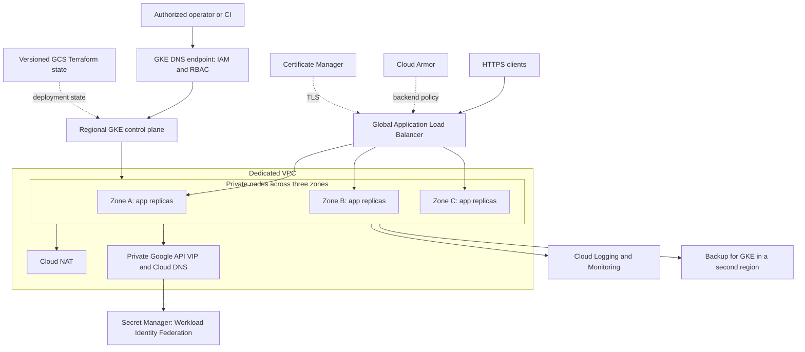

# Architecture and guidance mapping

Reviewed against the linked Google guidance on 2026-09-07. A cluster configuration is one part of production readiness; workload contracts, organization policy and recovery objectives need separate decisions.

## Address and capacity decisions

The default reserved allocation is `10.64.0.0/14`. Nodes use `10.64.0.0/20`, Pods use `10.65.0.0/16`, and Services use `10.66.0.0/20`. The remaining addresses are reserved for future network requirements. The root validates an aligned private allocation, and the network module derives disjoint subnets. It cannot detect overlap with networks outside this deployment: check peers, VPN, Shared VPC, on-premises networks and recovery networks before applying.

At 64 Pods per node, GKE reserves a `/25` Pod range per node. The Pod `/16` accommodates 512 node allocations. The default pool has 3 nodes minimum and 30 maximum, with another 3 surge nodes available during upgrades. The upper input limit leaves address headroom. CPU/disk/IP quotas and actual zonal capacity must cover upgrades and failover too. Changing network design after provisioning can require cluster replacement. See [GKE networking](https://docs.cloud.google.com/kubernetes-engine/docs/best-practices/networking) and [scalability planning](https://docs.cloud.google.com/kubernetes-engine/docs/best-practices/scalability).

The workload spreads across hostnames strictly and across zones preferentially, allowing rescheduling into surviving zones during an outage. A regional cluster does not survive loss of its entire region. Three replicas and a PDB protect against some failures and voluntary disruptions; they do not establish an availability SLO. Load-test peak traffic, node removal, a zone failure, and rolling upgrades while measuring latency and errors.

## Security boundaries

Private nodes, DNS-only cluster access, scoped IAM, and restricted workloads implement the baseline from [cluster hardening](https://docs.cloud.google.com/kubernetes-engine/docs/how-to/hardening-your-cluster). `dns_allow_external_traffic=true` allows authorized users through the DNS endpoint; it does not allow anonymous Kubernetes access. A VPC Service Controls perimeter is a separate organization decision. NetworkPolicy enforcement comes from Dataplane V2; enabling the Calico add-on alongside it is unnecessary.

The node identity has `roles/container.defaultNodeServiceAccount`, plus image-read permission on this repository. Application identities get per-secret grants through [Workload Identity Federation for GKE](https://docs.cloud.google.com/kubernetes-engine/docs/concepts/workload-identity). Different clusters in the same project share the identity pool: reusing a namespace/service-account name can confer the same cloud permissions. Separate trust boundaries into projects or add carefully designed IAM conditions.

Kubernetes Secrets have an additional KMS encryption layer, and Secret Manager is available for application secrets. Node disks and backups use Google-managed encryption. KMS key rotation does not automatically mean all existing ciphertext has been rewritten; follow the GKE re-encryption procedure before retiring versions, and retain keys needed for recovery. Customer-managed backup/disk keys and separation into a dedicated key project are compliance-driven extensions.

Artifact Registry provides immutable tags and vulnerability scanning. GKE's older workload vulnerability scanning has been [retired](https://docs.cloud.google.com/kubernetes-engine/docs/deprecations/vulnerability-scanning-gkee). CI still needs to evaluate scan results, create provenance/attestations and reject unacceptable releases. Binary Authorization supports an enforced attestor list; with no attestors this repository deliberately reports an audit-only rollout state. See [GKE security architecture](https://docs.cloud.google.com/docs/security/gke-security-bps).

## Guidance coverage and remaining choices

| Google guidance | Implemented here | Work still owned by the deployment team |
| --- | --- | --- |
| [GKE best-practices index](https://docs.cloud.google.com/kubernetes-engine/docs/best-practices) | Modular infrastructure, guardrails, workload templates, operational checks | Apply workload-specific recommendations and revisit new guidance |
| [Networking](https://docs.cloud.google.com/kubernetes-engine/docs/best-practices/networking) | VPC-native IP planning, private nodes, DNS endpoint, Dataplane V2, NAT, private Google access, managed DNS, optional Armor/Gateway | Existing/Shared VPC integration, network perimeter, service-to-service rules, external egress policy |
| [Hardening](https://docs.cloud.google.com/kubernetes-engine/docs/how-to/hardening-your-cluster) | Node hardening, keyless workload identity, restricted Pods, scoped roles, encrypted Secrets | Organization policies, Security Command Center enrollment, incident response, admin access review |
| [Production template](https://docs.cloud.google.com/application-design-center/docs/enterprise-grade-production-gke) | Regional cluster, multi-zone nodes, HA workload pattern, backups | Application deployment, supported image/probes, measured recovery and availability objectives |
| [Scalability](https://docs.cloud.google.com/kubernetes-engine/docs/best-practices/scalability) | Node autoscaler, HPA, VPA recommendations, capacity bounds and quotas | Users/RPS/latency model, realistic requests and limits, load tests, quota reservations |
| [Well-Architected Framework](https://docs.cloud.google.com/architecture/framework) | Security/reliability controls, observability, cost labels, controlled upgrades | SLOs, billing budgets, cost review, resilience drills, residency and sustainability decisions |

Organization policies and VPC Service Controls can affect unrelated projects; this new-cluster module does not invent an organization/folder topology. A service mesh is also not installed automatically: adopt one when authenticated east-west traffic or application authorization warrants the operating cost. Mutually untrusted tenants require stronger isolation than namespaced quotas and RBAC alone.

## Cost and sustainability

This baseline starts three on-demand nodes. Regional GKE, node disks, NAT, DNS queries, KMS, image scanning, logging, metrics, backups and optional public load balancing/Armor can all contribute costs. No monthly estimate is defensible without traffic, storage, region and retention requirements. Create a project-filtered billing budget with real notification recipients before deployment; a budget alerts and does not cap spend.

Use cost-allocation labels with Cloud Billing exports. Review idle workloads and VPA recommendations, tune HPA signals and resource requests, and avoid indefinite retention of unused images, metrics and logs. The registry intentionally has no active cleanup rule until rollback retention is agreed. Sampled VPC flow logs are enabled at 10%; Gateway logs initially capture all requests. Tune telemetry after confirming incident and audit needs. Consider Spot only for explicitly interruptible workloads in a separately tainted pool. Measure utilization and evaluate regional carbon/residency/latency tradeoffs under the [Well-Architected Framework](https://docs.cloud.google.com/architecture/framework).
