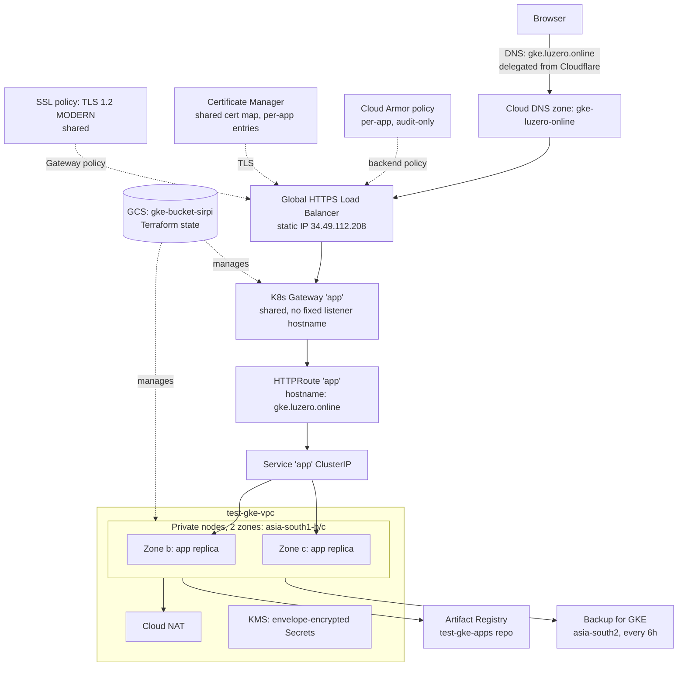

# Deployment Log: `test-gke`

What is actually live in `spartan-calling-484711-e5` right now, how it got
there, and what deviates from the general design in
[architecture.md](architecture.md) and why. `gcp-auth-setup.md` covers the
auth/IAM mechanics referenced below in detail.

## Current live state

| | |
|---|---|
| Project | `spartan-calling-484711-e5` |
| Cluster | `test-gke`, regional, `asia-south1` |
| Zones | `asia-south1-b`, `asia-south1-c` (**2, not 3** — see below) |
| Node pool | `general`, `e2-standard-2`, autoscaling 1–2/zone |
| Environment | `development` (deliberately scaled down, not production-sized) |
| Public endpoint | `https://gke.luzero.online` — verified `200 OK` |
| State backend | GCS bucket `gke-bucket-sirpi` (`bootstrap/`) |

Terraform-managed identity running all of this: `luvisjoston@gmail.com`, a
limited-access account (not the project's Owner) — see the role table in
`gcp-auth-setup.md` §5.

## How we got here

1. **Auth + billing.** Installed `gcloud`, set up ADC for a limited-access
   account, hit a closed/free-trial billing account, resolved by linking a
   second, already-open billing account (`018132-02DC39-A92792`) to the
   project.
2. **Bootstrap.** `bootstrap/` created the Terraform state GCS bucket
   (`gke-bucket-sirpi`, region `ASIA` multi-region).
3. **First `apply` attempt — zone stockout.** With the original 3-zone
   config (`asia-south1-a/b/c`) and `e2-medium`, node creation in
   `asia-south1-a` failed repeatedly with `GCE_STOCKOUT` /
   `ZONE_RESOURCE_POOL_EXHAUSTED` — Google had no spare capacity in that
   zone. Retried with `e2-standard-2`; same zone, same failure — confirmed
   it was the zone, not the machine type. GKE's own retry loop ran for
   ~35 minutes before giving up and failing the `CREATE_CLUSTER`
   operation (no way to cancel it earlier; GCP refuses delete/cancel while
   an operation is `RUNNING`).
4. **Dropped to 2 zones.** Rather than wait indefinitely or switch region,
   loosened the `length(var.zones) == 3` validation (root `variables.tf`
   and `modules/gke-cluster/variables.tf`) to `>= 2`, and moved to
   `asia-south1-b`/`c` — the two zones that had capacity. Fixed the
   `outputs.tf` `ip_plan` values (`min_nodes`/`max_nodes`/`surge_nodes`)
   that had `3` hardcoded to use `length(var.zones)` instead, so the
   reported capacity stays accurate at any zone count.
5. **Cluster + node pool created successfully.** An `apply` got
   interrupted right as it finished, which left
   `google_container_cluster.primary` marked **tainted** in state (a
   just-in-case "destroy and recreate" flag) even though the real cluster
   was healthy — fixed with `terraform untaint`, confirmed via `gcloud`
   before doing so.
6. **Monitoring alerts — real bugs in this repo's code.** Two of six alert
   policies failed to create: `ALIGN_COUNT`/`ALIGN_MEAN` aren't valid
   aligners for `gkebackup.googleapis.com/backup_completion_times`
   (`DELTA` + `DISTRIBUTION` metric type — confirmed via the Monitoring
   API's metric descriptor, not guessed). Fixed both
   (`modules/operations/monitoring.tf`) to use `ALIGN_PERCENTILE_99`,
   which is valid for that combination and preserves the same
   presence-based trigger semantics. The `condition_absent` block was also
   missing its `aggregations {}` entirely — added.
7. **Public HTTPS.** Domain `luzero.online` (owned, live traffic, DNS on
   Cloudflare) — delegated just the `gke` subdomain to a new public Cloud
   DNS zone (`gke-luzero-online`) via 4 NS records in Cloudflare, rather
   than moving the whole domain. Set `public_app` → `terraform apply`
   created the static IP, managed TLS cert, Cert Manager DNS
   authorization, SSL policy, Cloud Armor policy (audit-only /
   `waf_preview`). Built and pushed a minimal `busybox`-based smoke-test
   image (`/healthz`, `/readyz`, `/` on :8080) to the Terraform-created
   Artifact Registry repo, rendered `workloads/templates/*.yaml` via
   `scripts/render-workloads.py`, applied in the order `README.md`
   documents (foundation → application → edge-policy → edge-routing).
   Gateway showed `Programmed: True` and the cert `ACTIVE` within a few
   minutes, but the TLS handshake itself kept failing for a bit longer
   (`decode_error`) — confirmed everything was correctly configured on
   GCP's side (cert map entry, SSL policy, target proxy) and it was just
   the global anycast LB's edge propagation catching up; resolved on its
   own.
8. **Shared Gateway for multiple apps.** The original `https-gateway`
   module supported exactly one app per Gateway (one static IP, one cert,
   one LB — full stack duplicated per app). Refactored to a
   `public_apps` map: one shared static IP / SSL policy / cert map per
   cluster, with per-app DNS record / managed cert / DNS authorization /
   Cloud Armor policy. Split the Kubernetes side to match: a single
   `gateway.yaml` (`Gateway` + `GCPGatewayPolicy`, applied once, listener
   has no fixed hostname) plus one `edge-routing.yaml`
   (`HTTPRoute`, hostname-matched) and `edge-policy.yaml`
   (`GCPBackendPolicy`/`HealthCheckPolicy`/`NetworkPolicy`) per app.
   `render-workloads.py` gained `--app <key>` to select which app's edge
   config to render. Migrated with **zero resource recreation** — the
   existing app kept key `"app"` and its original (unsuffixed) resource
   names; only new app keys get name-suffixed resources. Fixed a test
   hole surfaced along the way: `terraform test` loads the real
   `terraform.tfvars` same as `plan`/`apply` does, so the "nothing
   configured" test case needs to explicitly override `public_apps = {}`
   rather than rely on the variable's default.

## Final architecture (as deployed, not the general blueprint)

Adding a second app reuses everything above `Route` — no new IP, no new
cert map, no new LB. Only new per-app pieces: a `public_apps` entry
(hostname + own Cloud Armor policy), a `HTTPRoute`, a `GCPBackendPolicy`,
and that app's own Deployment/Service.

## Known deviations from `architecture.md`'s general blueprint

- **2 zones, not 3** (`asia-south1-a` capacity-constrained at deploy time).
  Reduces the failure-domain redundancy the 3-zone design assumes; revisit
  if `asia-south1-a` capacity frees up, or before treating this as
  production-representative.
- **`environment = development`**, `e2-standard-2`, max 2 nodes/zone — a
  deliberately scaled-down test footprint, not the production sizing in
  `terraform.tfvars.example`.
- **Still not production-ready** per the live `release_readiness` output:
  `alert_delivery_configured: false` (no notification channels — alerts
  fire into Monitoring but page no one), `attestation_enforced: false`
  (Binary Authorization audit-only), `waf_enforced: false` (Cloud Armor
  audit-only). `requires_load_test`/`requires_restore_drill` are always
  `true` — neither has been done.
