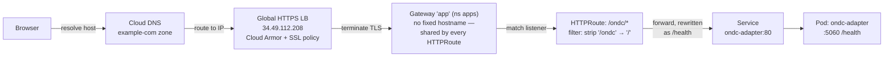
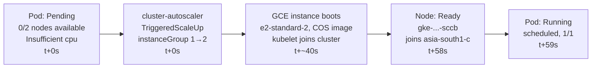
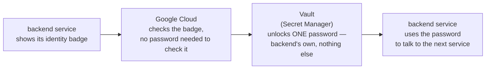
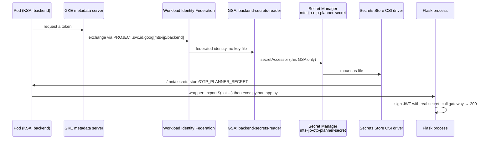
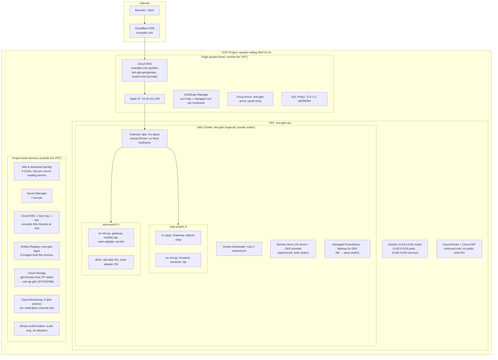

# Platform Architecture

Everything that's actually running, in one place — one shared Gateway, one
GKE cluster, two app stacks (the `gke` platform repo's own test app and the
`mts-ijp` stack riding on top of it), and every supporting service between
them, down to which secret each pod can read. All names/values below are
real, taken from the live project (`spartan-calling-484711-e5`, cluster
`test-gke`, `asia-south1`) — except the public hostname, which is written
here as `example.com` in place of the actual company domain.

## 1. What happens when a request comes in

Traced for one real example — `GET /ondc/health`. Every other public path
(`/api`, `/api/v1`, `/mobility/v1`, `/wa`, `/`) takes the same hops, just
landing on a different Service, with or without the rewrite step.

The rewrite step only fires for `ondc-adapter` and `wa-bot` — their own
code expects root-relative routes. `backend` and `mobility-api` skip it
since their code already answers on `/api/*` and `/api/v1`/`/mobility/v1`
natively.

## 2. Cluster autoscaler, the actual timeline

What happened, second by second, when a pod requested more CPU than
either running node had free — the same mechanism that fires on a real
traffic spike.

**Boot to `Ready` in 58 seconds** — fast because GKE nodes use pre-baked
images and `e2` boots quickly; a custom-image or heavier-bootstrap node
pool is more commonly 2–4 minutes. Node pool ceiling is
`max_nodes_per_zone = 2`, so this could repeat once more per zone before
the autoscaler gives up and leaves pods `Pending`.

## 3. How a service gets its password — without anyone writing it down

**In plain terms:** each of our 6 services that needs a password (an API
key, a signing secret, etc.) proves *who it is* to Google Cloud, the same
way an employee badge proves who you are at a locked door — no password
is ever typed into a config file, emailed, or stored on disk anywhere.
Google checks the badge, confirms which service it belongs to, and hands
over **only that one service's** password, locked in a vault the rest of
the system can't open. If someone got into the `wa-bot` service, they
still couldn't read `ondc-adapter`'s password — each badge only opens its
own vault.

That's the whole idea. Below is the same thing again, with the real
component names, for whoever's building or debugging this.

Technical version — the actual chain of systems involved

Traced for `backend` reading `OTP_PLANNER_SECRET`. Same chain for all 6
services that read secrets — only the identity/secret names change. The
twist this cluster forced: the "sync to a real Kubernetes Secret" feature
doesn't run here, so the last step reads the mounted file directly
instead of an env var Kubernetes would otherwise inject.

Least privilege, end to end: six GSAs exist, one per service, and each
can read *only* the secret(s) that one service needs — `wa-bot`'s GSA
cannot touch `ondc-adapter`'s secret, and vice versa. Getting this wrong
(the Dockerfile's placeholder secret instead of this real one) was
exactly the `backend` → `{"otp": "down"}` bug.

## 4. Every component, nothing skipped

## 5. Reference — every secret, every grant

| KSA | GSA | Can read | Used by |
|---|---|---|---|
| `otp` | `otp-gcs-reader` | GTFS bucket (`storage.objectViewer`) | fetches 4 GTFS/OSM files at startup |
| `gateway` | `gateway-secrets-reader` | `mts-ijp-otp-planner-secret` | verifies JWTs from `backend` |
| `backend` | `backend-secrets-reader` | `mts-ijp-otp-planner-secret` | signs JWTs to call `gateway` |
| `mobility-api` | `mobility-api-secrets-reader` | `mts-ijp-adapter-notify-secret` | authenticates callbacks from `ondc-adapter` |
| `ondc-adapter` | `ondc-adapter-secrets-reader` | `mts-ijp-mobility-api-notify-secret` | authenticates its own notify calls |
| `wa-bot` | `wa-bot-secrets-reader` | `whatsapp-token`, `wa-verify-token`, `phone-number-id`, `openrouter-api-key` | WhatsApp Graph API + LLM calls |
| `frontend` | *(none)* | — | no secrets needed |

## Public routes → backend

| Path | → Service | Rewrite |
|---|---|---|
| `/` | `frontend` | — |
| `/api` | `backend` | — |
| `/api/v1` | `mobility-api` | — |
| `/mobility/v1` | `mobility-api` | — |
| `/ondc` | `ondc-adapter` | strip → `/` |
| `/wa` | `wa-bot` | strip → `/` |

## Images in Artifact Registry (`test-gke-apps`)

| Image | Note |
|---|---|
| `backend` | Flask |
| `gateway` | rebuilt once — connection-close fix |
| `mobility-api` | FastAPI + `uv` |
| `ondc-adapter` | FastAPI, ONDC BAP |
| `frontend` | Node server, not nginx |
| `wa-bot` | Node/Express |
| `ondc-workbench-simulator` | built, not deployed |

---

See `docs/mts-ijp-deployment.md` and `docs/deployment-log.md` for the
narrative behind each piece, and `docs/learning-roadmap.md` for the
file-by-file build order.
