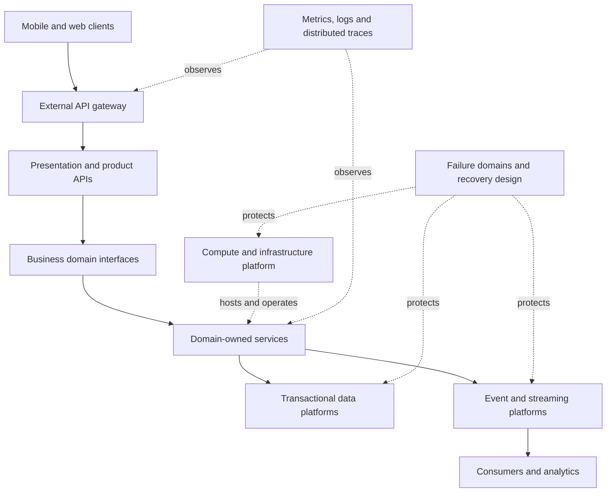
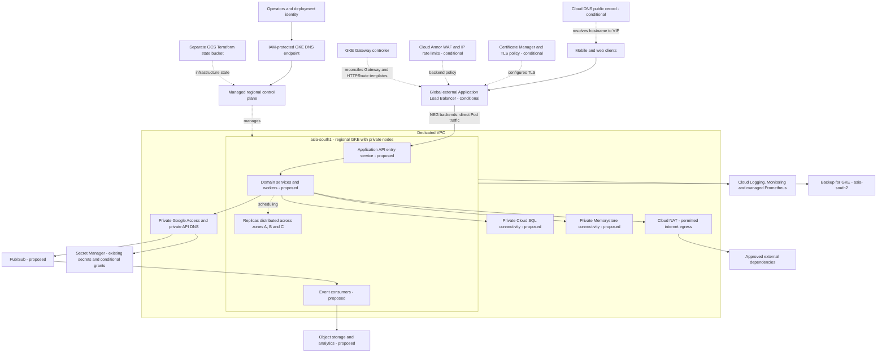
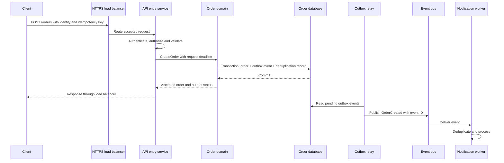

# Uber-inspired infrastructure architecture on GKE

Reviewed: 2026-09-08.

This guide connects Uber's published engineering designs to a complete application platform built around this repository. It covers the public entry point, networking, compute, business services, storage, events, security, delivery, observability, and recovery.

Uber's articles describe different systems at different points in time. They do not disclose a complete current infrastructure inventory. The Uber overview below is a synthesis of those publications; the GCP design is a proposal for this project, not a claim that Uber runs this exact stack. Writing this document does not deploy its proposed components.

## 1. What Uber has publicly described

| Layer | Published Uber design | Lesson for this project |
| --- | --- | --- |
| Infrastructure foundation | Crane describes infrastructure automation for a hybrid, multi-cloud environment, with dependency layers and failure-aware changes. | Keep bootstrap independent of the cluster it creates; make environments reproducible. [Crane](https://www.uber.com/us/en/blog/crane-ubers-next-gen-infrastructure-stack/) |
| Compute platform | Uber reports completing its shared stateless service migration to Kubernetes in July 2024, with integrations for deployment, discovery, security and observability. | Kubernetes needs a surrounding delivery and operations platform. This is not evidence that every Uber workload runs on GKE. [Kubernetes migration](https://www.uber.com/us/en/blog/migrating-ubers-compute-platform-to-kubernetes-a-technical-journey/) |
| External APIs | Uber's Edge Gateway provides protocol handling, middleware, authentication/authorization, backend clients and resilience controls. | Separate HTTP load balancing from application authentication and API behavior. [API gateway](https://www.uber.com/us/en/blog/architecture-api-gateway/) |
| Business services | Domain-Oriented Microservice Architecture groups services behind stable domain interfaces and constrains dependencies through layers. | Organize ownership around business capabilities, with explicit service contracts. [DOMA](https://www.uber.com/gb/en/blog/microservice-architecture/) |
| Transactional storage | Docstore evolved from Schemaless into a distributed transactional database with query, storage and control-plane layers. | Choose storage from consistency, access patterns and operational requirements. [Docstore](https://www.uber.com/us/en/blog/schemaless-sql-database/) |
| Event platform | Uber describes regional Kafka clusters, cross-region replication, and recovery of consumer progress. | Recovery must include events and processing state as well as application containers. [Kafka disaster recovery](https://www.uber.com/us/en/blog/kafka/) |
| Fulfillment | Uber's fulfillment redesign discusses entity lifecycle modeling, transactional coordination and failure isolation. Its failure-domain term “pod” is broader than a Kubernetes Pod. | Define state transitions and isolate failures deliberately. [Fulfillment architecture](https://www.uber.com/us/en/blog/fulfillment-platform-rearchitecture/) |
| Observability | Uber has published its use of Jaeger for tracing, M3 for metrics and XYS for sampling. | Follow requests across services and manage telemetry volume. [Observability](https://www.uber.com/en-BR/blog/optimizing-observability/) |

The following is a conceptual relationship diagram assembled from those sources, not an exact Uber deployment topology.



## 2. Target architecture for this GKE project

Status labels throughout this document:

- **Terraform:** implemented in this repository; deployment status must be checked in the real project.
- **Template:** manifest exists but must be rendered and applied separately.
- **Conditional:** created only when the relevant input is configured.
- **Proposed:** architecture extension; no implementation is included here.

Your shared plan configured one regional cluster in `asia-south1`, three node zones and backups in `asia-south2`. It had `public_app = null`, so the public edge shown below was not enabled. The diagram shows the intended public application design, including explicitly marked additions.



Cloud SQL and Memorystore are managed services; their boxes represent private connectivity, not databases installed on the GKE nodes. Proposed paths need corresponding IAM, networking and NetworkPolicy changes. The existing policies intentionally do not allow arbitrary service-to-service, database or internet access.

The current workload template runs one generic `app` service. The API entry service, business domains, workers and data systems in this target diagram still need implementation.

## 3. Where the load balancer and API gateway belong

There are four separate concepts:

| Component | Responsibility | Status here |
| --- | --- | --- |
| Google Cloud Application Load Balancer | Public IP, HTTPS termination, backend selection and health-based routing | Created by the GKE controller after deploying the configured Gateway |
| Kubernetes Gateway API | Declarative `Gateway` and `HTTPRoute` objects consumed by the controller | Cluster support enabled; public routing template available |
| Application API entry service | End-user authentication, request validation, API composition, per-user limits and backend call behavior | Proposed; the generic app does not implement these features |
| Business domain API | Stable interface to a domain's services and data | Proposed application design; need not be a separate proxy process |

The Google Cloud product named **API Gateway** is a separate service and is not provisioned by this repository. Uber's Edge Gateway is its own application platform; using Kubernetes Gateway API does not recreate it.

For this repository, the controller translates routing configuration into load-balancer resources, using `gke-l7-global-external-managed`. See [GKE Gateway deployment](https://docs.cloud.google.com/kubernetes-engine/docs/how-to/deploying-gateways). The separation between edge routing and application middleware follows the responsibilities described in [Uber's gateway article](https://www.uber.com/us/en/blog/architecture-api-gateway/).

```text
Configuration and reconciliation:
Terraform -> global IP + DNS + certificate + TLS policy + Cloud Armor
Gateway + HTTPRoute + GKE policies -> GKE controller -> load balancer

Traffic after reconciliation:
Client -> HTTPS load balancer -> healthy Pod IP:8080 via NEG
                                  |
                                  +-> application API logic -> domain services
```

The `HTTPRoute` references the Kubernetes Service on port 80. With container-native backends, this reference selects the backend Pods; it does not imply traffic must traverse the Service's ClusterIP. The current listener is HTTPS-only. Cloud Armor is attached as a load-balancer backend policy, not deployed as a firewall Pod.

Relevant files: [Terraform edge resources](../terraform/modules/https-gateway/main.tf), [Gateway and HTTPRoute](../workloads/templates/edge-routing.yaml), and [backend/security policies](../workloads/templates/edge-policy.yaml). Follow the [README deployment procedure](../README.md) for certificates, controller status and healthy backends before serving users.

## 4. Complete component inventory

| Area | Components and purpose | Repository status |
| --- | --- | --- |
| Organization and environments | Separate projects, environment ownership, organization policies and billing controls | Proposed organizational setup; project IDs are inputs |
| Terraform state | Protected GCS bucket, version history and restricted access | Terraform in [bootstrap](../bootstrap/main.tf); infrastructure GCS backend currently commented out for preview |
| VPC | Custom VPC with explicit regional subnet and Pod/Service secondary ranges | Terraform in [network](../terraform/modules/network/main.tf) |
| Address plan | Default `10.64.0.0/14`; nodes `/20`, Pods `/16`, Services `/20` in separate derived ranges | Terraform; overlap with other environments must be checked |
| Private API access | Private Google Access and private `googleapis.com` DNS records | Terraform |
| Outbound connectivity | Cloud Router, subnet-scoped Cloud NAT, NAT error logging | Terraform; egress still subject to workload policy |
| Network controls | GKE-managed VPC firewall rules, Dataplane V2 and namespace ingress/egress policy | GKE controls plus Templates; new dependencies need explicit rules |
| Public edge | Global IP, DNS record in an existing public zone, managed certificate, TLS policy, Cloud Armor | Conditional Terraform; Gateway and policy Templates complete the connection |
| Kubernetes compute | Regional control plane, private nodes in three zones, managed node pool, upgrades and repair | Terraform in [gke-cluster](../terraform/modules/gke-cluster/main.tf) |
| Scaling | Node pool autoscaling, HPA, VPA recommendations, resource quotas and requests | Terraform support plus Templates |
| Runtime isolation | Restricted Pod Security, non-root containers, read-only root filesystems, scoped RBAC | Templates; runtime enforcement requires deployment |
| Cloud identities | Dedicated node service account and workload identities with per-secret grants | Terraform in [security](../terraform/modules/security/main.tf) and [workload-identity](../terraform/modules/workload-identity/main.tf) |
| Secrets and encryption | Secret Manager add-on, existing secret references, KMS encryption for Kubernetes Secrets | Terraform; applications must implement secret consumption |
| Image supply chain | Artifact Registry, immutable tags, scanning and Binary Authorization policy | Terraform; attestation production and release enforcement need configuration |
| Application domains | Account, order/trip, matching, pricing, payment and notification capabilities | Proposed example domains, not existing services |
| Transactional database | Private managed PostgreSQL, HA, backup and point-in-time recovery configuration | Proposed |
| Cache | Managed Redis for disposable cached data | Proposed |
| Messaging | Event topics, subscriptions, consumers, replay policy and failed-message handling | Proposed |
| Object data and analytics | Dedicated application buckets, ingestion jobs and analytics datasets | Proposed; the state bucket is not application storage |
| Application integrations | Identity provider, payment provider, maps, push/email/SMS endpoints | Proposed; credentials, contracts and connectivity are application-specific |
| Telemetry | Cloud Logging, Monitoring, managed Prometheus, infrastructure alert policies | Terraform; alert recipients and application instrumentation need configuration |
| Distributed tracing | OpenTelemetry instrumentation, propagation, export and sampling | Proposed |
| CI/CD | Terraform validation and mocked plans in GitHub Actions | Existing CI; image build, attestations, deployment and rollback automation are proposed |
| Recovery | Backup for GKE in a second region, retention and alert policies | Terraform; restoration, database recovery and regional failover require more work |
| Cost control | Resource labels and GKE cost allocation | Terraform; budgets, usage review and retention targets need configuration |

The source of truth for module composition is [terraform/main.tf](../terraform/main.tf). The [existing architecture guide](architecture.md) explains the cluster settings in more detail.

## 5. Business services and data ownership

The following domain split is an example for a ride/order application. Adapt it to the actual product before creating services.

| Domain | Owns | Example interface |
| --- | --- | --- |
| Accounts | User profile and account status | `GetAccount`, `UpdateProfile` |
| Orders/trips | Authoritative lifecycle and booking state | `CreateOrder`, `CancelOrder` |
| Matching | Assignment decisions and capacity matching | `RequestAssignment` |
| Pricing | Quotes, expiry and price calculation | `CreateQuote` |
| Payments | Payment intent, provider references and reconciliation | `AuthorizePayment` |
| Notifications | Delivery preferences and message attempts | Consume `OrderConfirmed` |

Keep cross-domain access behind APIs and versioned events. Give each domain ownership of its records; avoid one service modifying another domain's tables. Multiple domains can initially live in one codebase or share a database instance with appropriate logical separation. A domain boundary does not require a dedicated cluster or database server.

Uber's DOMA article describes layers from infrastructure through business, product, presentation and edge, and domain gateways that hide internal implementation details. Apply the interface and dependency principles at the size your team can operate. [Read DOMA](https://www.uber.com/gb/en/blog/microservice-architecture/).

### A proposed request and event flow



This flow is a proposed application contract. An outbox makes the database change and intent to publish atomic; it does not make database and broker delivery one global transaction. Consumers need idempotency, bounded retries and recovery from partial effects. Notification failure should not erase an accepted order. Multi-step workflows need explicit compensation and reconciliation rules.

## 6. Storage, events and analytics choices

For an initial production design, evaluate the following managed components. These are GCP options for this project, not one-to-one replacements for Uber's internal products.

| Need | Candidate | Decisions before implementation |
| --- | --- | --- |
| Transactional records | Cloud SQL for PostgreSQL with regional HA | Schema, indexes, connection limits, private connectivity, PITR, backup retention and recovery targets. [HA documentation](https://docs.cloud.google.com/sql/docs/postgres/high-availability) |
| Disposable cache | Memorystore for Redis | HA tier, memory ceiling, eviction, cache invalidation and behavior during cache failure. [Overview](https://docs.cloud.google.com/memorystore/docs/redis/memorystore-for-redis-overview) |
| Asynchronous business events | Pub/Sub | Ordering requirements, acknowledgement/retry behavior, retention, dead letters and subscriber IAM. [Overview](https://docs.cloud.google.com/pubsub/docs/overview) |
| Documents and exports | Separate Cloud Storage buckets | Ownership, retention, lifecycle rules and least-privilege access. [Overview](https://docs.cloud.google.com/storage/docs/introduction) |
| Product analytics | BigQuery with a separate ingestion path | Dataset permissions, event schema, retention and query cost controls. [Overview](https://docs.cloud.google.com/bigquery/docs/introduction) |

Uber's Kafka design illustrates why replication and consumer recovery must be designed together. Pub/Sub is not Kafka protocol-compatible; choose Kafka instead if the actual workload requires its APIs or ecosystem, and design its operations separately. [Uber's Kafka recovery design](https://www.uber.com/us/en/blog/kafka/).

Location ingestion, geospatial search, stream processing and ML serving can become separate systems when the product needs them. They are not prerequisites for this GKE foundation. Specify update frequency, freshness, retention and latency requirements before selecting those components. Analytics should consume events or exports instead of putting heavy reporting queries on the transactional request path.

## 7. Security and network paths

The existing cluster uses private nodes and a DNS control-plane endpoint. Operators need authorized cloud identities and appropriate Kubernetes access. Workloads use Kubernetes service-account identities for allowed Google API operations; the node identity is separate from application permissions. See the repository's [security boundary explanation](architecture.md#security-boundaries).

For the proposed multi-service application, define and verify this connectivity matrix:

| Caller | Allowed destination | Intended control |
| --- | --- | --- |
| Internet clients | Public application HTTPS listener | TLS, Cloud Armor and application AuthN/AuthZ |
| Load-balancer proxies/health checks | Selected public application Pods | GKE routing, health checks and ingress policy |
| API entry service | Explicit domain APIs | Service identity, authorization, ingress/egress policy and deadlines |
| Domain service | Its database/cache endpoints | Private connectivity, scoped credentials and port-specific egress |
| Event producer/consumer | Required topics/subscriptions | Workload identity and resource-scoped IAM |
| Workload | DNS and approved Google APIs | Existing policy baseline plus required IAM grants |
| Integration service | Approved external provider endpoints | Explicit egress design, TLS and application credentials |
| Operator/deployment job | GKE DNS endpoint | IAM, Kubernetes RBAC and audit logging |

Cloud NAT supplies outbound translation; it does not enforce a domain allowlist. Kubernetes NetworkPolicy controls network reachability; it does not establish application identity or encrypt traffic. If authenticated and encrypted east-west traffic is required, implement application TLS/mTLS or evaluate a managed service mesh. No mesh is currently installed.

The optional edge currently terminates HTTPS at the load balancer and uses the application's HTTP port 8080 behind it. End-to-end TLS requires additional backend and certificate configuration. Enabling a WAF also does not implement user authorization.

## 8. Build, release and operations platform

Uber's compute migration describes deployment safety and observability work around Kubernetes. For this repository, the following is a proposed delivery pipeline beyond the existing validation workflow. [Uber's migration account](https://www.uber.com/us/en/blog/migrating-ubers-compute-platform-to-kubernetes-a-technical-journey/).


Use a short-lived deployment identity. Keep infrastructure plans and application releases reviewable as separate changes. The existing Binary Authorization policy audits by default; configure trusted attestors and test rejection before relying on it for admission enforcement. Database migrations must remain compatible with both the new and previous application versions during a rollout.

Current infrastructure metrics are a starting point. Add application request rate, error rate, latency, queue lag, database saturation and business completion metrics. Define service-level objectives and connect alerts to real responders. Instrument traces across HTTP/RPC calls and asynchronous events, redact sensitive fields and limit metric cardinality. Uber's published tracing and metrics experience motivates this visibility; [OpenTelemetry](https://opentelemetry.io/docs/specs/otel/overview/) provides a standard instrumentation approach, with [Google Cloud OTLP ingestion](https://docs.cloud.google.com/stackdriver/docs/otlp/overview) as an export option. [Uber observability article](https://www.uber.com/en-BR/blog/optimizing-observability/).

## 9. Availability and disaster recovery

| Failure | Present foundation | Additional acceptance work |
| --- | --- | --- |
| Container/node loss | Health probes and replicated workload templates; node repair | Deploy templates and measure recovery under load |
| Zone loss | Regional cluster and three node zones | Verify scheduling, spare capacity and dependent data services |
| Bad application release | Rolling update configuration | Add detection, a tested rollback process and safe schema migrations |
| Entire cluster region lost | Backups in another region | Recreate compute, restore supported data and validate a traffic cutover |
| Database failure/corruption | No application database provisioned | Add HA, PITR and isolated restore tests for the selected database |
| Lost or duplicate events | No broker provisioned | Establish retention, replay, deduplication and consumer recovery |

A backup region is not a running standby application region. The current repository does not configure automatic multi-region failover. For a future second cluster, plan separate state and CIDRs, image/secret availability, data replication, consumer ownership and traffic routing together. Active-active writes require explicit conflict and consistency decisions.

Define RTO (maximum acceptable recovery time) and RPO (maximum acceptable data loss) for each business capability. A six-hour backup schedule alone does not prove a six-hour RPO. Use the [restore drill](operations.md#restore-drill-and-regional-outage) and record measured outcomes. Uber's fulfillment and Kafka publications show different failure-isolation and recovery concerns; copying one topology does not establish recovery for this application's dependencies. [Fulfillment](https://www.uber.com/us/en/blog/fulfillment-platform-rearchitecture/), [Kafka](https://www.uber.com/us/en/blog/kafka/).

## 10. Practical implementation order

1. Finish the existing foundation: restore the GCS backend before production, configure notification channels, and verify IAM, quotas and private connectivity.
2. Deploy one working application using the existing restricted workload templates. Verify its probes, identity, network policy and scaling.
3. If public access is needed, configure `public_app`, deploy edge policies and routing, and verify certificates, load-balancer health, WAF behavior and application authentication.
4. Add the first required database and its backup/restore procedure. Introduce events only for a concrete asynchronous workflow.
5. Build an image release pipeline, attestation enforcement, tracing, application SLOs and a tested rollback process.
6. Split domains and scale capacity as ownership or measured demand requires. Add regional recovery infrastructure when the agreed recovery targets justify it.

Your earlier plan used three `e2-medium` nodes initially and a six-node autoscaling ceiling, with separate surge headroom. This is a test configuration whose production capacity remains unproven. Use it to learn the foundation; the proposed data and platform additions each bring their own operational and cost requirements.

## 11. Reading order

Read the Uber sources in this order to build the architecture from service boundaries down to recovery. Publication years indicate the historical context, not a guarantee about today's entire Uber fleet.

| Order | Source | Focus |
| --- | --- | --- |
| 1 | [Domain-Oriented Microservice Architecture — Uber, 2020](https://www.uber.com/gb/en/blog/microservice-architecture/) | Domain interfaces and dependency layers |
| 2 | [The Architecture of Uber's API Gateway — Uber, 2021](https://www.uber.com/us/en/blog/architecture-api-gateway/) | Edge responsibilities and middleware |
| 3 | [Crane — Uber, 2022](https://www.uber.com/us/en/blog/crane-ubers-next-gen-infrastructure-stack/) | Infrastructure automation and bootstrap dependencies |
| 4 | [Migrating Uber's Compute Platform to Kubernetes — Uber, 2025](https://www.uber.com/us/en/blog/migrating-ubers-compute-platform-to-kubernetes-a-technical-journey/) | Compute migration, deployment safety and platform integrations |
| 5 | [Fulfillment Platform Re-architecture — Uber, 2021](https://www.uber.com/us/en/blog/fulfillment-platform-rearchitecture/) | Stateful business workflows and failure isolation |
| 6 | [Evolving Schemaless into a Distributed SQL Database — Uber, 2021](https://www.uber.com/us/en/blog/schemaless-sql-database/) | Transactional storage design |
| 7 | [Disaster Recovery for Multi-Region Kafka — Uber, 2020](https://www.uber.com/us/en/blog/kafka/) | Replication and event-consumer recovery |
| 8 | [Optimizing Observability with Jaeger, M3 and XYS — Uber, 2019](https://www.uber.com/en-BR/blog/optimizing-observability/) | Tracing, metrics and sampling |

For the GKE implementation, continue with [Google's best-practice mapping in this repository](architecture.md#guidance-coverage-and-remaining-choices), the [deployment README](../README.md), and [production acceptance checks](operations.md).
